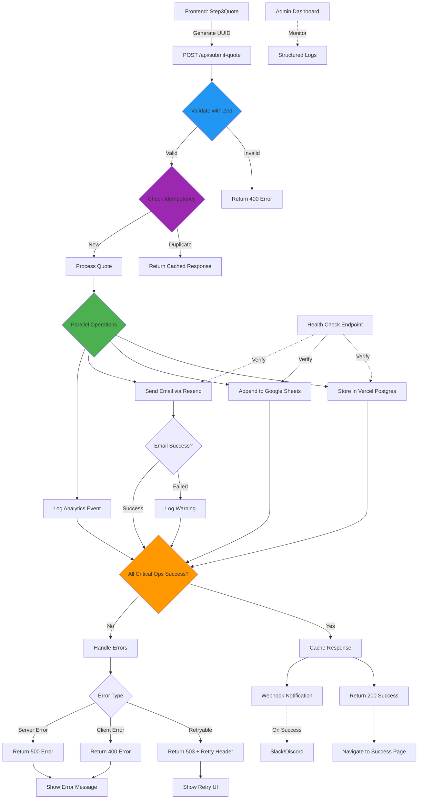

# Quote Submission API

This directory contains the serverless API implementation for handling insurance quote submissions using Vercel Functions.

## Overview

The API processes quote data from the frontend, validates it, stores it securely, and sends confirmation emails. It uses a robust architecture with parallel operations, idempotency, and comprehensive error handling.

## Architecture



## API Endpoints

### POST /api/submit-quote
Main endpoint for quote submissions.

**Request Body:**
```typescript
{
  insuranceType: 'auto' | 'home' | 'life' | 'health' | 'business'
  formData: InsuranceFormData
  quote: Quote
  contactInfo: {
    name: string
    email: string
    phone: string
    preferredLanguage?: 'es' | 'en'
  }
  referenceNumber: string
  idempotencyKey: string
  createdAt: string
  updatedAt: string
  consentGiven: boolean
  marketingOptIn: boolean
  source?: string
  userAgent?: string
}
```

**Response:**
```typescript
{
  success: boolean
  referenceNumber: string
  warnings?: Array<{
    code: 'EMAIL_DELAYED' | 'SHEETS_SLOW' | 'ANALYTICS_FAILED'
    message: string
  }>
  error?: {
    code: string
    message: string
    retryable: boolean
    retryAfter?: number
  }
  processingTime?: number
  timestamp: string
}
```

### GET /api/health
Health check endpoint for monitoring service status.

**Response:**
```typescript
{
  status: 'healthy' | 'degraded' | 'unhealthy'
  checks: {
    postgres: { status: 'up' | 'down', latency?: number }
    kv: { status: 'up' | 'down', latency?: number }
    sheets: { status: 'up' | 'down', latency?: number }
    resend: { status: 'up' | 'down', latency?: number }
  }
  timestamp: string
}
```

### GET /api/quote/[reference]
Retrieve a submitted quote by reference number.

**Response:**
```typescript
{
  referenceNumber: string
  insuranceType: string
  formData: object
  quote: object
  contactInfo: object
  status: string
  createdAt: string
  updatedAt: string
  consentGiven: boolean
  marketingOptIn: boolean
  source?: string
}
```

## Implementation Details

### Technologies Used
- **Runtime**: Node.js (Vercel Functions)
- **Database**: Vercel Postgres
- **Cache**: Vercel KV (Redis)
- **Validation**: Zod schemas
- **Email**: Resend API
- **Sheets**: Google Sheets API
- **Encryption**: AES-256-GCM (Node.js crypto)
- **Logging**: Structured JSON logging

### Security Measures
- Input validation with Zod
- Rate limiting (email and IP-based)
- Encryption of sensitive data (PII)
- Idempotency keys to prevent duplicates
- HTTPS enforcement
- CORS restrictions

### Parallel Operations
The submit-quote endpoint executes multiple operations concurrently:
1. **Database Storage** (Critical): Save to Vercel Postgres
2. **Google Sheets** (Non-critical): Append for business Excel exports
3. **Email Notification** (Non-critical): Send confirmation email
4. **Analytics** (Non-critical): Log submission events

### Error Handling
- Comprehensive error categorization
- Retry logic for transient failures
- Detailed error responses with retry guidance
- Structured logging for debugging

### Data Flow
1. Frontend generates UUID for idempotency
2. Request validated with Zod schemas
3. Rate limiting checked
4. Idempotency verified via Vercel KV
5. Parallel operations executed
6. Response cached for idempotency
7. Success/failure returned to frontend

### Environment Variables
- `POSTGRES_URL`: Vercel Postgres connection
- `KV_URL`: Vercel KV connection
- `GOOGLE_SERVICE_ACCOUNT_KEY`: Google Sheets auth
- `RESEND_API_KEY`: Email service auth
- `ENCRYPTION_KEY`: AES encryption key
- `ENCRYPTION_SALT`: Encryption salt
- `GOOGLE_SHEET_ID`: Target spreadsheet ID
- `FROM_EMAIL`: Sender email address

### Database Schema
See `api/lib/schema.sql` for the complete PostgreSQL schema with indexes and triggers.

### Monitoring
- Structured logging to Vercel logs
- Health checks for all services
- Performance metrics (latency, success rates)
- Error rate monitoring

## Deployment
Deployed as Vercel Functions with automatic scaling. Database migrations run via Vercel Postgres CLI or dashboard.

## Testing
- Unit tests for utilities (encryption, validation)
- Integration tests for API endpoints
- Load testing for concurrent submissions
- Error scenario testing

## Future Enhancements
- PDF quote generation with Vercel Blob
- Webhook notifications for external systems
- Advanced analytics dashboard
- Multi-language email templates
- Admin panel for quote management